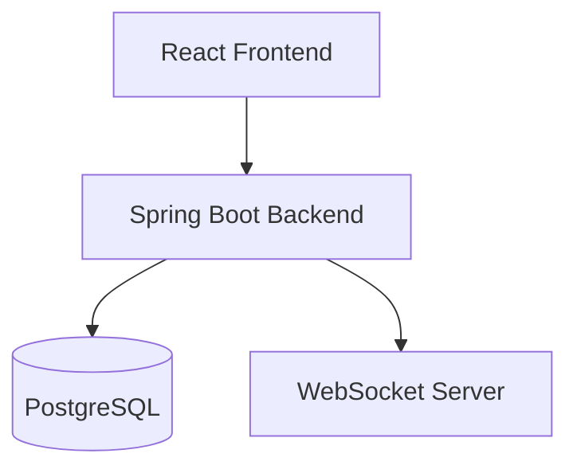
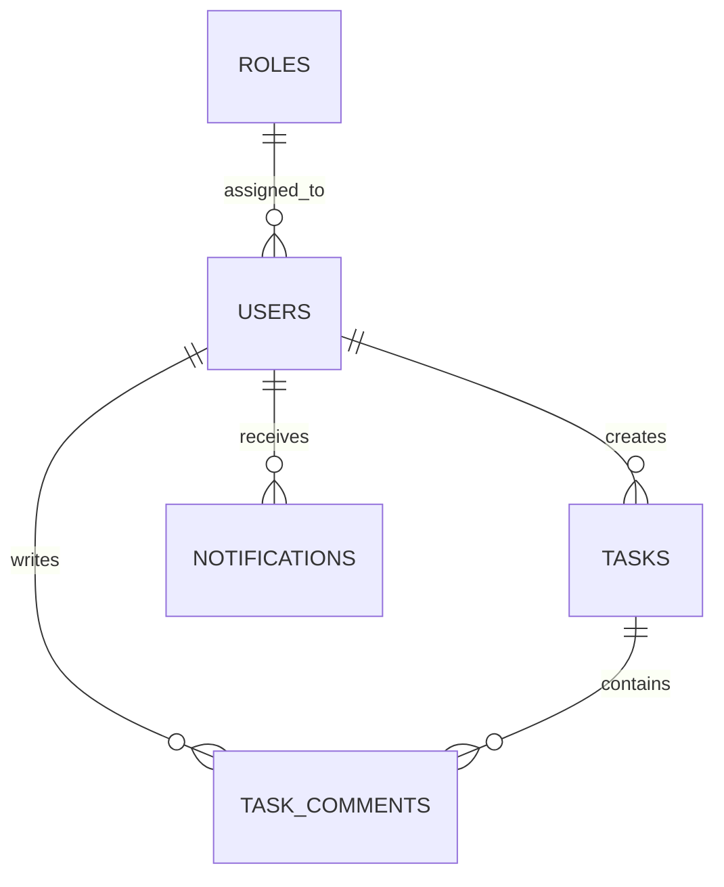

# Task Management Full-Stack Application

A modern, responsive task management application with JWT authentication, real-time updates, and intuitive Kanban board functionality. Built with React, Spring Boot, and PostgreSQL.

.png)

## Project Overview

This full-stack application provides a complete task management solution with:

- **User Authentication**: Secure JWT-based login, registration, and token refresh
- **Task Management**: Create, read, update, and delete tasks with priority levels
- **Kanban Board**: Visual drag-and-drop interface for task status management
- **Real-time Updates**: WebSocket-powered notifications and activity tracking
- **Responsive Design**: Mobile-friendly interface with Tailwind CSS

### Architecture



### Database Schema



## Installation

### Prerequisites

- Docker and Docker Compose
- Git

### Quick Start

1. **Clone the repository**
   ```bash
   git clone https://github.com/pranjalKumarglbtim/Task-Management-Full-Stack-Application.git
   cd Task-Management-Full-Stack-Application
   ```

2. **Start all services**
   ```bash
   docker-compose up --build
   ```

3. **Access the application**
   - Frontend: http://localhost:80
   - Backend API: http://localhost:8080
   - PostgreSQL: localhost:5432

### Development Setup

#### Backend (Spring Boot)
```bash
cd backend
./mvnw spring-boot:run
```

#### Frontend (React/Vite)
```bash
cd frontend
npm install
npm run dev
```

## Usage

### Authentication

1. Navigate to http://localhost:80/login
2. Register a new account or login with existing credentials
3. Upon successful authentication, you'll be redirected to the dashboard

### Dashboard

The main dashboard provides:

- **Statistics Overview**: Total tasks, completed, pending, and completion rate
- **Task Board**: Quick view of tasks organized by status (TODO, In Progress, Done)
- **Recent Activity**: Timeline of recent actions

.png)

### Managing Tasks

1. **Create a Task**:
   - Click "Create Task" button on dashboard or "Add" on Tasks page
   - Enter title, description, and priority
   - Submit to add to your task list

2. **View Tasks**:
   - Navigate to Tasks page to see all tasks in grid or list view
   - Use search and status filters to find specific tasks

3. **Edit Task Status**:
   - Go to Board page for drag-and-drop status updates
   - Or click into a task for detailed editing

.png)

### Profile Management

Access your profile settings via the sidebar to:
- Update username and email
- Manage notification preferences
- Toggle dark mode

.png)

## Key Features

### 🎨 Modern UI/UX
- Clean, minimal design with Tailwind CSS
- Responsive layout for all devices
- Smooth animations and transitions

### 🔒 Security
- JWT token authentication
- Role-based access control
- Secure password handling with BCrypt

### 📱 Responsive Design
- Mobile-first approach
- Sidebar navigation with active states
- Adaptive grid layouts

### 🔄 Real-time Updates
- WebSocket integration for notifications
- Live task status updates
- Activity timeline

### 🐳 Docker Deployment
- Containerized services
- Easy setup with docker-compose
- Isolated development environment

## Project Structure

```
task-management-app/
├── backend/
│   ├── src/main/java/
│   │   └── com/taskmanagement/
│   │       ├── config/
│   │       ├── controller/
│   │       ├── dto/
│   │       ├── entity/
│   │       ├── exception/
│   │       ├── repository/
│   │       ├── security/
│   │       ├── service/
│   │       └── websocket/
│   └── pom.xml
├── frontend/
│   ├── src/
│   │   ├── api/
│   │   ├── components/
│   │   ├── pages/
│   │   ├── store/
│   │   └── types/
│   ├── package.json
│   └── vite.config.ts
├── docker-compose.yml
└── README.md
```

## API Endpoints

### Authentication
| Endpoint | Method | Description |
|----------|--------|-------------|
| `/auth/register` | POST | Register new user |
| `/auth/login` | POST | Authenticate user |
| `/auth/refresh` | POST | Refresh JWT token |
| `/auth/logout` | POST | Invalidate token |

### Tasks
| Endpoint | Method | Description |
|----------|--------|-------------|
| `/tasks` | GET | Get all tasks |
| `/tasks` | POST | Create new task |
| `/tasks/{id}` | GET | Get task by ID |
| `/tasks/{id}` | PUT | Update task |
| `/tasks/{id}` | DELETE | Delete task |
| `/tasks/activity` | GET | Get recent activity |

### Notifications
| Endpoint | Method | Description |
|----------|--------|-------------|
| `/notifications` | GET | Get user notifications |
| `/notifications/read` | PUT | Mark all as read |

## Troubleshooting

### Common Issues

**1. Docker containers not starting**
```bash
# Check container logs
docker-compose logs backend
docker-compose logs frontend

# Rebuild containers
docker-compose down
docker-compose up --build
```

**2. Database connection issues**
- Ensure PostgreSQL container is healthy
- Check credentials in `docker-compose.yml`
- Wait 10-15 seconds for backend to connect to database

**3. Port conflicts**
- Frontend runs on port 80
- Backend runs on port 8080
- PostgreSQL runs on port 5432
- Stop other services using these ports before starting

**4. CORS errors**
- Backend CORS is configured for localhost:80
- Check `backend/src/main/java/com/taskmanagement/config/CorsConfig.java`

**5. Authentication not working**
- Clear browser localStorage to remove stale tokens
- Check if backend is running and accessible
- Verify JWT secret in `application.yml`

### Development Notes

- Backend has a 10-second startup delay to wait for database
- Frontend is served via nginx in production mode
- All API calls use relative paths through the nginx proxy

## License

MIT License - See LICENSE file for details

## Contributing

Contributions are welcome! Please feel free to submit a Pull Request.