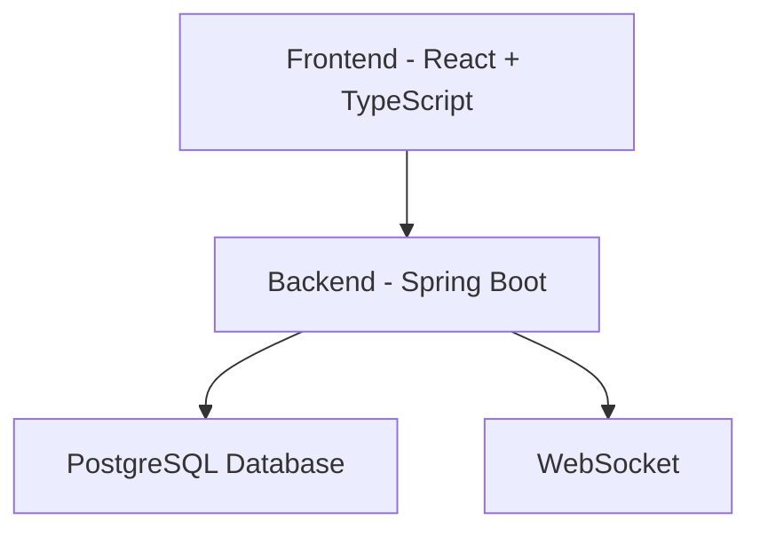
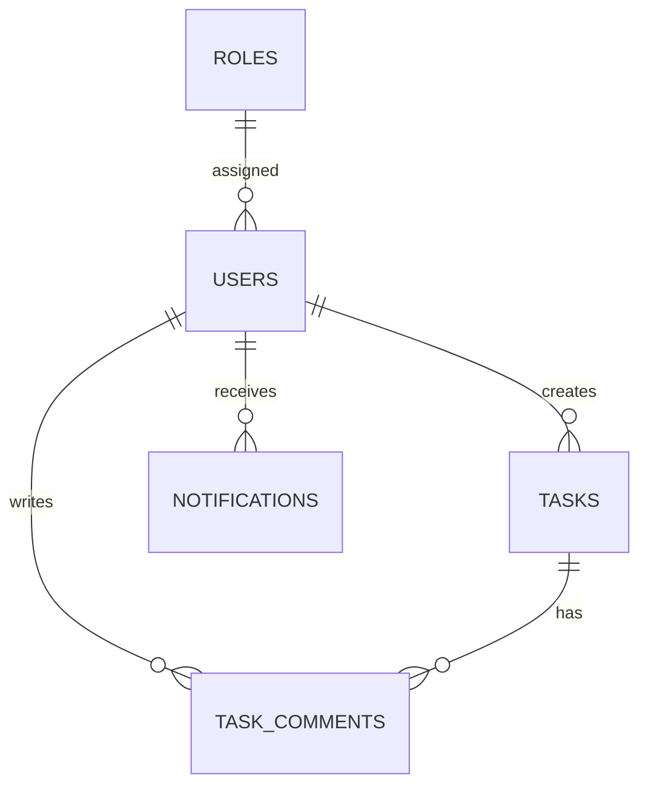

# Task Management Application

A modern full-stack task management application with JWT authentication, real-time WebSocket updates, and Kanban board functionality.

## Features

- 🔐 JWT Authentication (Login/Register/Refresh)
- 📋 Task management (Create/Read/Update/Delete)
- 🎨 Kanban board with drag-and-drop
- 🔔 Real-time notifications via WebSocket
- 📱 Responsive design with Tailwind CSS
- 🌙 Dark mode support

## Architecture



## Database ER Diagram



## Screenshots

.png)
.png)
.png)
.png)

## Quick Start

```bash
docker-compose up --build
```

## Access

- Frontend: http://localhost:80
- Backend API: http://localhost:8080
- PostgreSQL: localhost:5432

## API Endpoints

### Authentication
- POST /auth/register - Register user
- POST /auth/login - Login user
- POST /auth/refresh - Refresh token
- POST /auth/logout - Logout user

### Tasks
- GET /tasks - Get all tasks
- GET /tasks/activity - Get recent activity
- POST /tasks - Create task
- GET /tasks/{id} - Get task by ID
- PUT /tasks/{id} - Update task
- DELETE /tasks/{id} - Delete task

### Notifications
- GET /notifications - Get notifications

## Tech Stack

- **Frontend**: React, TypeScript, Vite, Tailwind CSS, React Query
- **Backend**: Spring Boot, Java 17, JWT, PostgreSQL
- **Database**: PostgreSQL 16
- **Deployment**: Docker, Docker Compose

## Development

```bash
# Run all services
docker-compose up -d

# View logs
docker-compose logs -f backend

# Stop services
docker-compose down
```

## Environment

Default credentials (PostgreSQL):
- Username: postgres
- Password: postgres
- Database: taskdb